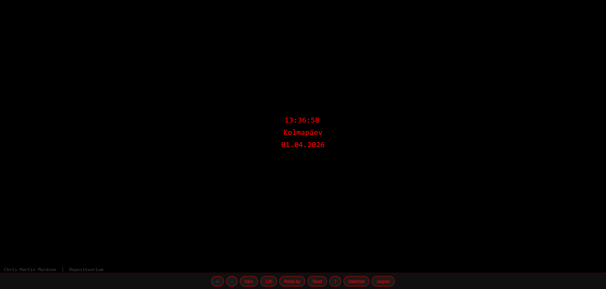

## Digitaalkell

## Autor: Chris-Martin Murdvee

## Ekraanipilt

## Kirjeldus

Digitaalkell, mida saab kasutada lauakella või ekraanisäästjana.
Kell näitab praegust kellaaega, kuupäeva, nädalapäeva ja aastat.
Kõiki seadeid saab muuta nuppudega ning nupp "Vaikimisi" lähtestab
kõik algolekusse.

## Funktsionaalsus

**+** --> Suurenda kella teksti fondi (max 200px)

**-** --> Vähenda kella teksti fondi (min 10px)

**Värv** --> Muuda kella ja kuupäeva teksti värvi

**12h / 24h** --> Lülita 12-tunnise (AM/PM) ja 24-tunnise formaadi vahel

**Peida kp / Näita kp** --> Peida või näita kuupäev ja nädalapäev

**Taust** --> Muuda lehekülje tausta värvi

**?** --> Liiguta kell, kuupäev ja nädalapäev ekraanil juhuslikesse kohtadesse, vajuta uuesti, et tagasi panna

**Vaikimisi** --> Lähtesta kõik seaded algsesse olekusse

**Jaapan / Eesti** --> Kuva Jaapani (UTC+9) aeg, vajuta "Eesti" et tagasi lülitada

Fondi suurust saab muuta ka klaviatuuriga: **+** suurendab, **-** vähendab.
