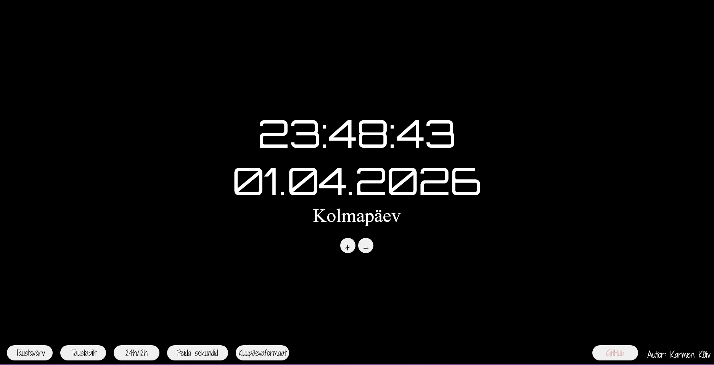

# kodutoo-1

## Autor

- Marcus Haljasoks

## Funktsionaalsus

1. Vajutades "+" ja "-" saab kella suurust muuta, lisaks saab kellaajale vajutades suuremaks teha ja kuupäevale vajutades väiksemaks
2. Vajutades "space" muutub taustapilt
3. Vajutades "wasd" saabliigutada kella asukohta
4. Paremal üleval nurgas on kella fonti muutmiseks nupud, mis on nähtamatud kuniks nende kohal olla hiirega
5. Kerides alla on all vasakul nurgas nupp kella värvi muutmiseks

## Ekraanipilt rakendusest

