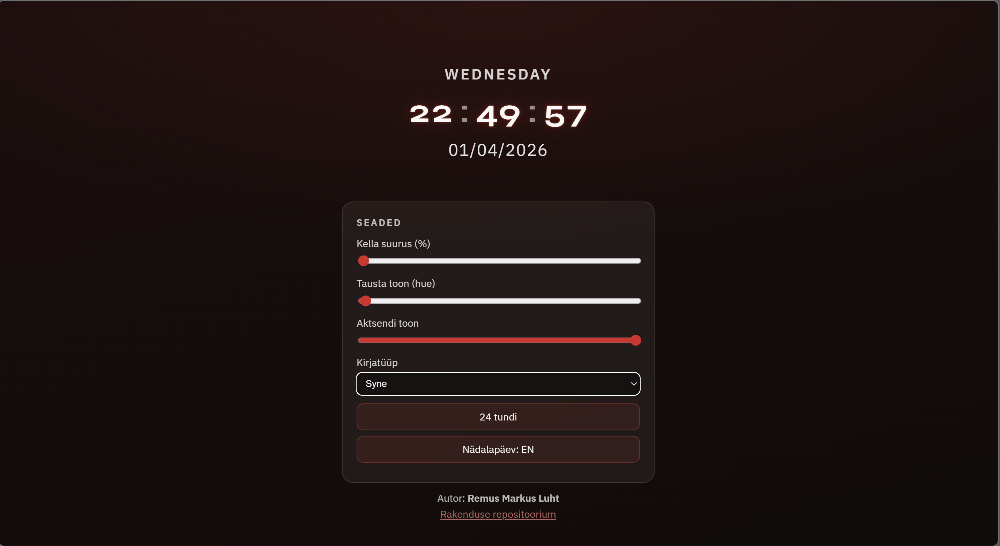

# kodutoo-1 — lauakell

## Tähtaeg 01.04.2026 23:59

**Autor:** Remus Markus Luht

**Repositoorium:** [https://github.com/remus-markusluht/kodutoo-1](https://github.com/remus-markusluht/kodutoo-1)

## Ekraanipilt

## Funktsionaalsus

- Täisekraaniline lauakell: **tunnid, minutid, sekundid**, **kuupäev** (päev.kuu.aasta), **nädalapäev** ja **aasta** on kuupäeva real näha (aasta kuupäeva osana).
- **Kuus kasutaja poolt muudetavat atribuuti:** kella suurus (%), tausta toon (hue), aktsendi toon, kirjatüübi valik (Orbitron / Syne / IBM Plex Sans), 12/24-tunnine formaat, nädalapäeva keel (ET/EN).
- **Sündmused:** `addEventListener` liuguritele, nuppudele ja valikule; uuendamine `setInterval`-iga.
- **OOP:** loogika on `DeskClock` klassis failis `clock.js`.
- **Kujundus:** protsent-põhised `clamp`/`vw`/`vh` mõõdud, CSS-muutujad; Google Fonts.
- Lehel on **autori nimi** ja **viide repositooriumile**.

Käivitamine: ava `clock.html` brauseris (fail või kohalik server).

## Promptid (koodi genereerimine)

Promptide viited on koodis kommentaaridena failides `clock.html`, `clock.css`, `clock.js` (ülesande nõue).

## Laenatud / viited

- JavaScripti `Date` API: [MDN Date](https://developer.mozilla.org/en-US/docs/Web/JavaScript/Reference/Global_Objects/Date)
- CSS custom properties: [MDN Using custom properties](https://developer.mozilla.org/en-US/docs/Web/CSS/Using_CSS_custom_properties)
- Google Fonts: [fonts.google.com](https://fonts.google.com) (Orbitron, Syne, IBM Plex Sans)

---

## Algsed ülesande juhised (kursus)

Max 20 punkti.

Kujunda elektroonilise kella näide vastavalt maitsele või kindlale teemale, mahutades kella täisekraanile, et saaks kasutada lauakella või ekraanisäästja asemel. Selleks, et see sobiks paljudele ekraanidele, kasuta kujunduse loomisel protsendilisi väärtusi (nt width: 100%; ) või nt võimalda kella suurust kasutajal muuta.

### Nõuded

1. Veebirakendus töötab. Näitab kella, kuupäeva, nädalapäeva ja aastat.
1. Vastavalt kasutaja tegevusele on võimalik muuta **kuut** lauakella atribuuti muuta.
1. Kasutatud on eventListener'e ja funktsioone.
1. Kell on originaalne ning kasutajaliides on maitsekalt kujundatud kasutades CSS-i.
1. Autori ees- ja perenimi on lehel välja toodud
1. Lehel on viide rakenduse repositooriumile
1. `README.md` failis on välja toodud autori nimi, ekraanipilt rakendusest ja kirjeldatud funktsionaalsus
1. Viidata kogu koodis promptidele, millega kood saadi.

### GitHub'i töövoog kodutöö esitamiseks

1. *Fork*'i ülesande/projekti repositoorium (leiab [https://github.com/eesrakendused-2026/](https://github.com/eesrakendused-2026/)).
1. *Clone*'i see repositoorium enda arvutisse/serverisse ja määra repositooriumi URL kuhu edaspidi muudatusi salvestad.
1. Muuda faile ülesande lahendamiseks ja *commit*'i olulised muudatused.
1. *Push*'i GitHub'i ja ava *pull request* ülesande originaalses repositooriumis.

Tagasiside: maini kommentaaris `@taurikirsipuu`.

### Stiilinõuded

* Muutujate nimed inglise keeles; lühikesed funktsiooninimed; loetav reavahe (~80 tähemärki).
* Objektorienteeritud lähenemine; laenatud koodile viidata.

## Abimaterjal

* [HTML DOM Events](http://www.w3schools.com/jsref/dom_obj_event.asp)
* [JavaScript Timing Events](http://www.w3schools.com/js/js_timing.asp)
* [HTML DOM Style Object](http://www.w3schools.com/jsref/dom_obj_style.asp)
