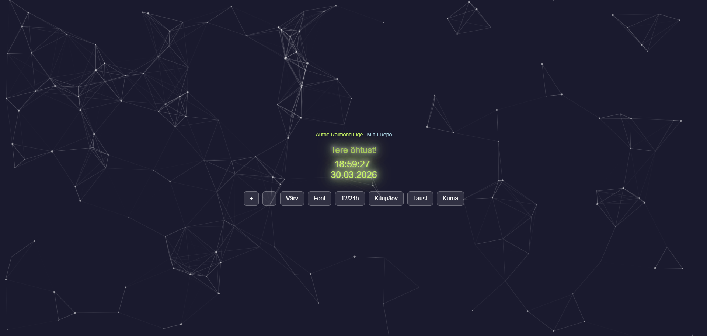

# Interaktiivne digikell

See projekt on veebipõhine digitaalne kell, mis on ehitatud kasutades objektorienteeritud JavaScripti (OOP). Rakendus toimib nii praktilise ajanäitajana kui ka visuaalselt kaasahaarava taustana, pakkudes kasutajale palju võimalusi kella välimuse isikupärastamiseks.

## Autor
**Raimond Lige**

## Ekraanipilt

## Funktsionaalsus

Kella on võimalik juhtida nii ekraanil olevate nuppude kui ka osaliselt klaviatuuriga. Kasutaja saab muuta järgmisi atribuute ja efekte: 

1. **Fondi suuruse muutmine:** Kella ja kuupäeva suurust saab muuta vajutades ekraanil nuppe **"+"** ja **"-"** või kasutades klaviatuuril vastavaid klahve (`+` ja `-`). Suurusel on määratud miinimum- ja maksimumpiirid (10px kuni 200px).
2. **Teksti värvi muutmine:** Nupp "Värv" vahetab teksti värvi tsüklina etteantud paleti alusel.
3. **Kirjatüübi (Fondi) vahetamine:** Nupp "Font" muudab tsüklina kella kirjatüüpi.
4. **12h / 24h formaat:** Nupp "12/24h" võimaldab lülitada standardse 24-tunnise ajaformaadi ja 12-tunnise (AM/PM) formaadi vahel.
5. **Kuupäeva nähtavus:** Nupp "Kuupäev" lülitab kuupäeva kuvamise sisse ja välja, jättes ekraanile soovi korral vaid minimalistliku kella.
6. **Taustavärvi muutmine:** Nupp "Taust" vahetab tumedaid taustatoone.
7. **Neoon-kuma (Glow):** Nupp "Kuma" lülitab sisse laheda helendava `text-shadow` efekti, mille toon kohandub automaatselt valitud teksti värviga.
8. **Dünaamiline tervitus:** Kell jälgib kasutaja kellaaega ning kuvab automaatselt sobivat tervitust (nt "Tere hommikust!", "Tere päevast!", "Tere õhtust!" või "Head ööd!").
9. **Interaktiivne taust:** Kella taustal jookseb `particles.js` raamatukogu abil loodud osakeste süsteem, mis reageerib hiirekursorile (kursor tõmbab osakesi ligi ja klikkides tekib osakesi juurde).

## Kasutatud tehnoloogiad
* **HTML5:** Lehe struktuur.
* **CSS3:** Kujundus, paigutus (Flexbox), sujuvad üleminekud (`transition`) ja helendavad efektid (`text-shadow`).
* **JavaScript (ES6):** Kella loogika, objektorienteeritud lähenemine (klass `Clock`), sündmustekuulajad (Event Listeners) ja DOM-i manipuleerimine.
* **Välised teegid:** `particles.js` (taustaefektide jaoks).

## Kuidas käivitada
1. Klooni see repositoorium või laadi failid alla.
2. Ava fail `clock.html` mis tahes kaasaegses veebibrauseris.
3. Kuna projekt kasutab välist CDN-linki (`particles.js` laadimiseks), on vajalik internetiühendus.

## Tehisintellekti (AI) kasutamine
Projekti loomisel, vigade otsimisel (debugging) ja spetsiifiliste lisafunktsioonide loomisel kasutasin Google Gemini Pro 3.1 abi. Terve koodi kopeerimise asemel küsisin abi konkreetsete osade, OOP loogika, vigade lahendamise kohta ja README faili koostamisel.

Siin on mõned näited promptidest (päringutest), mida arendusprotsessis kasutasin:
* **OOP struktuur (JS):** *"Mul on valmis kirjutatud töötav JS kood, kus on eraldi funktsioonid kella uuendamiseks ja fondi suuruse muutmiseks. Kuidas ma saaksin selle ümber kirjutada objektorienteeritud (OOP) stiili, kasutades klassi 'Clock' ja konstruktorit?"*
* **12/24h formaat (JS):** *"Kuidas lisada digikellale funktsioon, mis muudab nupuvajutusega kellaaja 24-tunnisest formaadist 12-tunnisesse (koos AM/PM lühenditega) ja vastupidi?"*
* **Tingimuslaused ja tervitus:** *"Kuidas ma saan JS-is if/else lausetega kõige mõistlikumalt kontrollida, millisesse vahemikku praegune tund jääb (nt 5 kuni 12 on hommik), et kuvada ekraanile vastav tekst?"*
* **Vigade parandamine (Debugging):** *Saatsin tehisintellektile ekraanipildi oma brauseri konsoolist, mis näitas viga "Uncaught TypeError: Cannot set properties of undefined (setting 'innerHTML')", ja küsisin: "Miks mu leht pärast koodi muutmist valgeks läks ja kuidas ma selle vea korda saan?"*
* **Dokumentatsiooni (README) koostamine:** *"Kuidas kirjutada professionaalset README faili GitHubi jaoks? Anna mulle näide sarnase rakenduse README-st."*