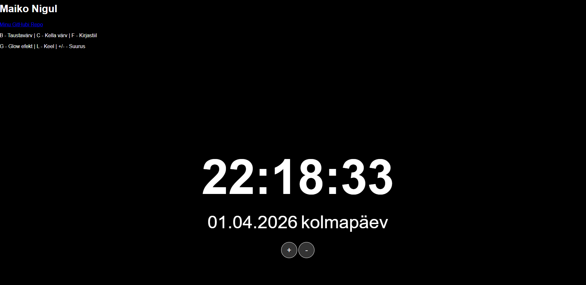

# Digitaalne Lauakell
**Autor:** Maiko Nigul

## Kirjeldus
See on veebipõhine elektrooniline kell, mis on loodud kasutamiseks täisekraanil. Kell on responsiivne ja kohandub vastavalt brauseri akna suurusele.

## Funktsionaalsus
Vastavalt nõuetele saab muuta 6 atribuuti:
1. **Fondi suurus** (Nupud +/- või klahvid +/-)
2. **Taustavärv** (Klahv B)
3. **Teksti värv** (Klahv C)
4. **Kirjastiil** (Klahv F)
5. **Helendus/Glow efekt** (Klahv G)
6. **Keel (ET/EN)** (Klahv L)

## Ekraanipilt

## Viited
Koodi kirjutamisel on kasutatud AI abi (Gemini 3 Flash) järgmistes osades:
- Nädalapäeva nime genereerimine `toLocaleDateString` abil.
- CSS-i täiendamine `vw` ühikutega responsiivsuse tagamiseks.