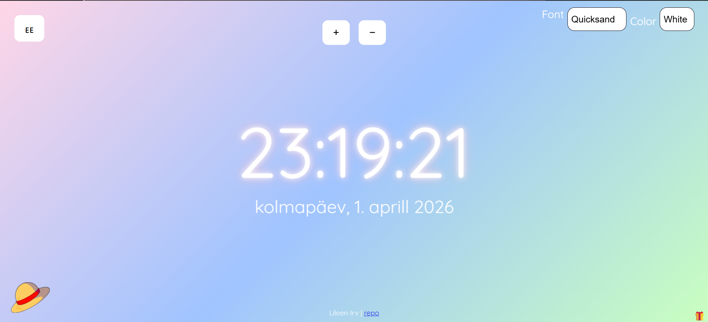

Autor: Lileen Irv

Rakendus kuvab täisekraanil elektroonilise kella,
mida saab kasutada lauakella või ekraanisäästjana.

Kell näitab:

- kellaaega
- kuupäeva
- nädalapäeva
- aastat

Kasutaja saab:
- muuta kella suurust + ja - nuppudega
- muuta taustavärvi SPACE klahviga
- liigutada kella nooleklahvidega
- vahetada kella fonti ja värvi
- valida eesti keele ja inglise keele vahel
- ka on kaks interaktiivset üllatustega nuppu

Rakendus kasutab:

- HTML
- CSS
- JavaScript

https://github.com/Lileen-I/kodutoo-1